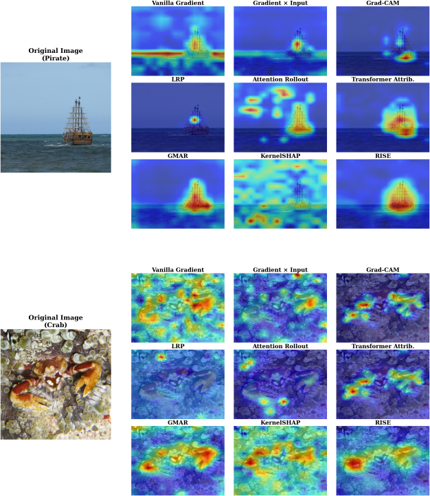

# From Gradients and Relevance to Black-box: Interpretability of Vision Transformer Models

A comparative analysis of nine interpretability methods applied to Vision Transformer models.

---

## Methods

**Gradient-based methods**
- Vanilla Gradient
- Input × Gradient
- GradCAM

**Relevance propagation**
- LRP (Layer-wise Relevance Propagation)

**Attention-based methods**
- Attention Rollout
- Transformer Attribution
- GMAR (Gradient-Driven Multi-Head Attention Rollout)

**Black-box methods**
- Kernel SHAP
- RISE

---

## Repository Structure
```text
src/
├── loader/ # Data, model and bounding box annotation loading
├── models/ # ViT implementation with LRP-compatible modules
└── xai/
├── gradient/ # Gradient-based methods
├── attention/ # Attention-based methods
├── lrp/ # Layer-wise relevance propagation
└── black_box/ # RISE and Kernel SHAP

scripts/
└── run_eval.py # Main evaluation pipeline

xai-comparative-analysis.ipynb # Aggregated results and visualizations
xai_evaluation_report/ # LaTeX thesis report
```
---

## Running

Run the complete evaluation pipeline:

```bash
python -m transformer_interpretability.scripts.run_eval
```

The pipeline generates saliency maps for all methods and saves results in JSON format.
Results are visualized and analyzed in `xai-comparative-analysis.ipynb`.

---

## Results



| Method | MoRF AUC ↓ | LeRF−MoRF ↑ | Pointing Game ↑ | Time |
|--------|-----------|------------|----------------|------|
| Vanilla Gradient | 0.518 | 0.076 | 66.0% | 44.69 ms |
| Input × Gradient | 0.515 | 0.076 | 62.8% | 45.81 ms |
| GradCAM | 0.456 | 0.159 | 70.2% | 30.18 ms |
| LRP | 0.537 | 0.063 | 62.2% | 180.57 ms |
| Attention Rollout | 0.515 | 0.040 | 42.9% | 18.36 ms |
| Transformer Attribution | 0.326 | 0.334 | 84.4% | 212.27 ms |
| GMAR | 0.418 | 0.210 | 76.8% | 48.62 ms |
| Kernel SHAP | 0.494 | 0.122 | 62.6% | 52.58 s |
| **RISE** | **0.198** | **0.648** | **85.7%** | 38.62 s |

*Kernel SHAP and RISE times correspond to 8000 and 6000 masks respectively.*

---

## Model and Data

- **Model:** ViT-Base/16-224, pretrained on ImageNet-21k
- **Dataset:** ImageNet(validation set)
- **Bounding box annotations:** Official ILSVRC annotations